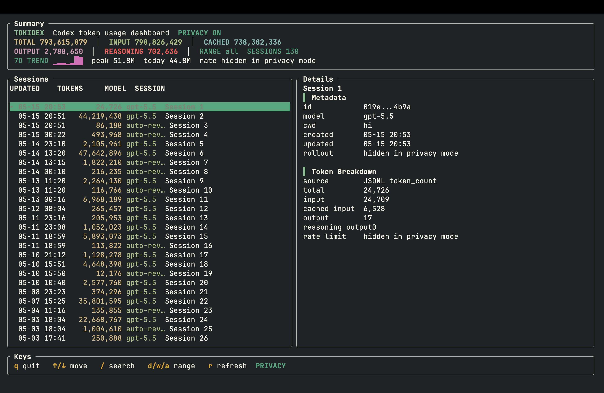

# tokidex

[](https://crates.io/crates/tokidex)
[](LICENSE)
[](https://github.com/michaelmjhhhh/tokidex)

`tokidex` is a macOS terminal UI for inspecting local Codex token usage.

It reads Codex's local state only: no network calls, no Codex auth token access,
and no billing guesses.



## Install

```sh
cargo install tokidex
tokidex --privacy --range all
```

`cargo install` places the binary in `~/.cargo/bin`. If `tokidex` is not found
after installation, add Cargo's bin directory to your shell `PATH`:

```sh
echo 'export PATH="$HOME/.cargo/bin:$PATH"' >> ~/.zshrc
source ~/.zshrc
tokidex --privacy --range all
```

Update an existing install:

```sh
cargo install tokidex --force
```

## Why

Codex stores useful local token usage signals, but they are not easy to inspect
at a glance. `tokidex` turns that local state into a small TUI so you can see
which sessions used tokens, compare today/week/all ranges, and inspect token
breakdowns when detailed JSONL events are available.

## Features

- Session list with model, updated time, and total token usage.
- Today, last 7 days, and all-history filters.
- Detail view for input, cached input, output, reasoning output, and total
  tokens.
- Search by title, model, cwd, or session id.
- Refresh in place without restarting the TUI.
- Privacy mode for screenshots and streams.

## Privacy Mode

Use privacy mode before sharing screenshots or streaming:

```sh
tokidex --privacy --range all
```

Privacy mode hides full session titles, local paths, rollout JSONL paths, full
session ids, and rate limit details. Token counts and model names remain
visible.

## Data Sources

`tokidex` resolves the Codex home directory in this order:

1. `--codex-home <path>`
2. `$CODEX_HOME`
3. `~/.codex`

It reads `state_5.sqlite` for session summaries and totals, then parses each
session `rollout_path` JSONL file for the latest `token_count` event. When JSONL
details are missing or malformed, the UI falls back to the SQLite total.

`tokidex` is a local read-only viewer. It reads Codex's local SQLite and JSONL
state files, never reads `auth.json`, and does not send usage data anywhere.

## Usage

```sh
tokidex --range today
tokidex --range week
tokidex --range all
tokidex --privacy --range all
tokidex --codex-home ~/.codex --range all
```

Run without installing:

```sh
cargo run -- --range today
```

Install from a local checkout for development:

```sh
cargo install --path .
tokidex --range today
```

Remove an old local/path install, then reinstall from crates.io:

```sh
cargo uninstall tokidex
cargo install tokidex
```

## Keys

- `q`: quit
- `Up/Down` or `k/j`: move selection
- `/`: search
- `Esc`: clear search
- `d`: today
- `w`: week
- `a`: all
- `r`: refresh

## Verification

```sh
cargo test
cargo fmt --check
cargo clippy -- -D warnings
```
